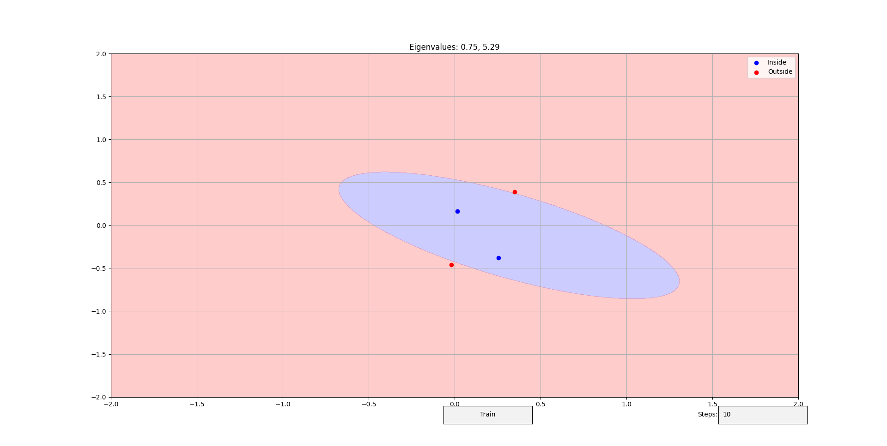

# Perceptron Ellipse

Implementation of a perceptron algorithm that trains a binary classifier
to classify points inside and outside an ellipse
using Python + [NumPy][numpy], [Numba][numba], [Matplotlib][matplotlib],
and [SciPy][scipy].

Check out the following Medium stories to know more about this project:
- [Perceptron. Part 1: The Story Retold][medium-1];
- [Perceptron. Part 2: The Story Untold][medium-2].

## Installation

You need Python 3.12 and [pipenv].
Then, create a virtual environment and install the needed dependencies:
```bash
pipenv shell
pipenv install
```

Alternatively, you can use [venv] or any other virtual environment tool
and install the following packages:
- [numpy 2.0][numpy-2]
- [numba 0.60][numba-0.60]
- [matplotlib 3.9][matplotlib-3.9]
- [scipy 1.14][scipy-1.14]
  (required for [Numba][numba] to solve systems of linear equations)

## Usage

Run the script `__main__.py`:
```bash
python .
```

You should see a GUI
that allows you to add your own points and train the classifier.
Controls:
- Left-click to add a point inside the ellipse;
- Right-click to add a point outside the ellipse;
- Enter the number of training iterations and click "Train"
  to train the classifier with a custom number of iterations.

Also, [Matplotlib][matplotlib] provides a toolbar with position and zoom controls.



[matplotlib]: https://matplotlib.org
[matplotlib-3.9]: https://matplotlib.org/stable/users/prev_whats_new/whats_new_3.9.0.html
[medium-1]: https://medium.com/@valeriy.krygin/perceptron-part-1-the-story-retold-2065c341b60d
[medium-2]: https://medium.com/@valeriy.krygin/perceptron-part-2-the-story-untold-a05029c2629d
[numba]: https://numba.pydata.org
[numba-0.60]: https://numba.readthedocs.io/en/stable/release/0.60.0-notes.html
[numpy]: https://numpy.org
[numpy-2]: https://numpy.org/devdocs/release/2.0.0-notes.html
[pipenv]: https://pipenv.pypa.io/en/latest
[venv]: https://docs.python.org/3/library/venv.html
[scipy]: https://www.scipy.org
[scipy-1.14]: https://scipy.github.io/devdocs/release/1.14.1-notes.html